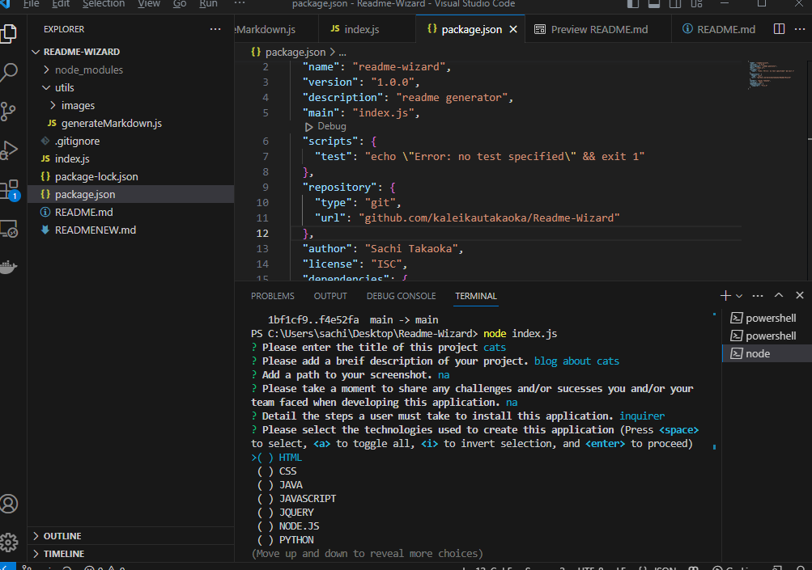

# Readme Wizard!
 
 ## Table of Contents
  - [Description](#Description)
  - [Image](#Image)
  - [Challenges](#Challenges)
  - [Installation](#Installation)
  - [Technologies](#Technologies)
  - [License](#License)
  - [Contributors](#Contributors)
  - [Tests](#Tests)
  - [Contact](#Contact)
  - [Github](#github)
  - [Questions](#questions)
  
  ## Description
  Create a custome Readme from scratch with this simple and easy readme generator. Simply download the teach and plug in your response!

  ## Image
  <table>
<tr>
<td>Readme Wizard</td>
</tr>
<tr>
<td></td>
</tr>
</table>
  [Untitled Video Fri Jun 30 2023](https://app.castify.com/view/ec084d16-cb47-4474-a19b-c98a9fce64f8)

  ## Challenges
  Overall this assignment was fun. I had some slight challenges when it came to ordering the prompts.

  ## Installation
  NPM install inquirer.js
  For more documentation or for the most up to date method and package please refer to this link---> 

  ## Technologies
  Node.js, Inquirer, Javascript

  ## Contributors
  Sachi Takaoka

  ## Contact
  sasa@gmail.com

  ## Github
  - [https://kaleikautakaoka.github.io](https://github.com/kaleikautakaoka/)

  ## Resources
[Node.js](https://nodejs.org/en)
[inquirer](https://www.npmjs.com/package/inquirer)
[mozilladeveloper](https://developer.mozilla.org/en-US/docs/Learn)
[Youtube](https://www.youtube.com/watch?v=1Rs2ND1ryYc)
[stackoverflow](https://stackoverflow.co/teams/?utm_source=adwords&utm_medium=ppc&utm_campaign=kb_teams_search_nb_dsa_targeted_audiences_namer&_bt=658164167919&_bk=&_bm=&_bn=g&gclid=CjwKCAjw-vmkBhBMEiwAlrMeF6t62u2_YPgOhZlqF8IaB6aH_RpLce6VnEaeK-T8AYuyqca1LnhevhoCKTwQAvD_BwE)
 
  
  
  